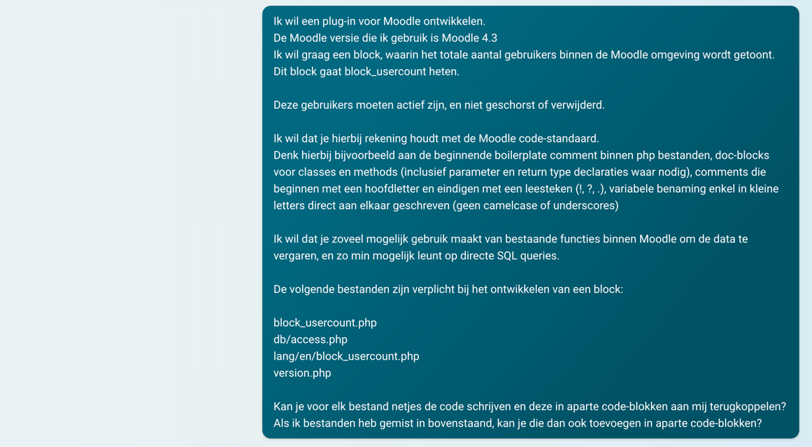
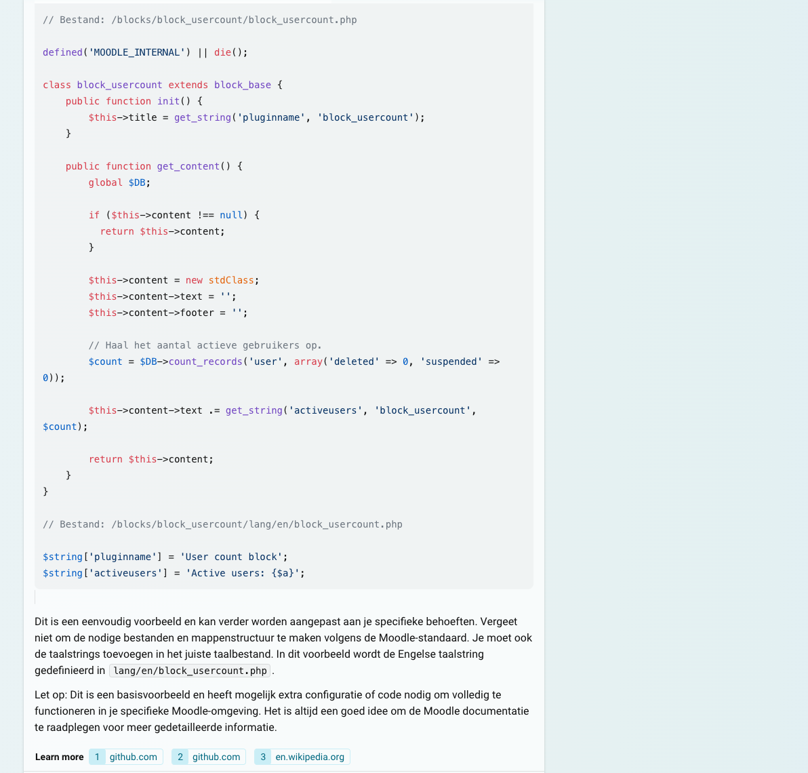
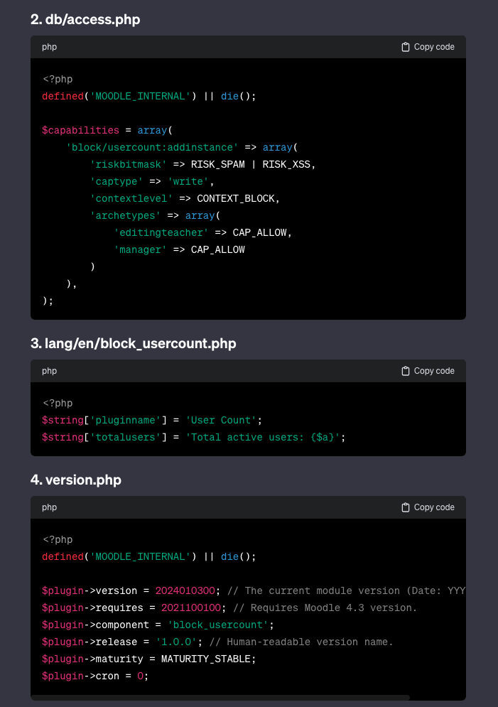
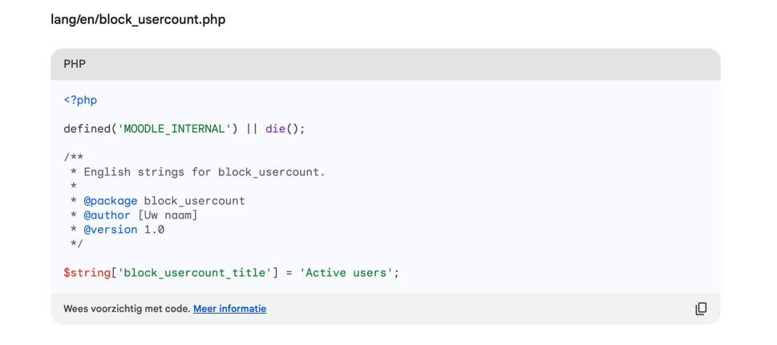
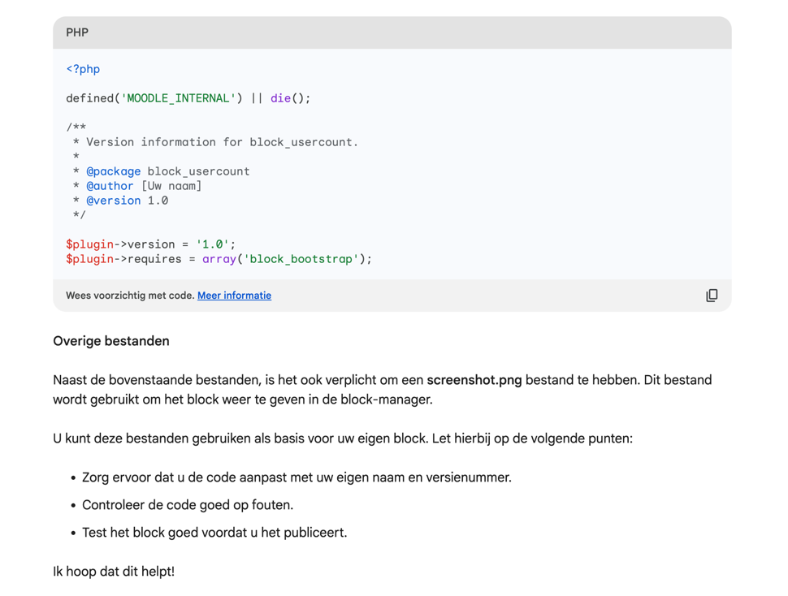

# Block Usercount

### Een AI product demonstratie

## Blocks developer documentatie
https://moodledev.io/docs/apis/plugintypes/blocks

## Code standaard
https://moodledev.io/general/development/policies/codingstyle

# Google Bard (Pathways Language Model) interpretatie van een uitgebreidere prompt

## Welke benodigde bestanden zijn aanwezig
- `block_usercount.php` ✅
- `db/access.php` ✅
- `lang/en/block_usercount.php` ✅
- `version.php` ✅

## Welke nuttige bestanden zijn extra aanwezig
- Geen

## Welke bestanden zijn aanwezig maar overbodig
- Geen

## Wat is goed
- De benodigde bestanden zijn aanwezig.
- Opzet docblock comments geplaatst voor de classes/methods.
  - Deze dienen nog wel zelf aangevuld te worden.

## Wat is niet goed
- Helaas is de inhoud, ondanks de uitgebreidere prompt, nog niet correct.
- `version.php`
  - Bevat `1.0` voor `$plugin->version`, dit zou een versie notering (2024012600) moeten zijn.'
  - Bevat `array('block_bootsrtrap')` voor `$plugin->requires`. Hier zou echter de benodigde Moodle versie moeten staan.
  - `$plugin->component` ontbreekt.
- `block_usercount.php`
  - `__construct()` zoals hier aangemaakt hoort niet.
  - Binnen `get_content()` wordt in mdl_user database gekeken naar 'status', een niet bestaand veld.
  - Ook de `$output` wordt niet netjes opgebouwd maar met een html string.'
- `db/access.php`
  - Dit bestand is volledig incorrect.
- `lang/en/block_usercount.php`
  - Mist noodzakelijke strings.
  - De enige aangemaakte string wordt niet gebruikt binnen de eigen code.
- Moodle code standaard
    - Geen van de bestanden begint met de vereiste documentatie.
- "Naast de bovenstaande bestanden, is het ook verplicht om een screenshot.png bestand te hebben. Dit bestand wordt gebruikt om het block weer te geven in de block-manager."
  - Deze 'tip' van Google Bard is onjuist.

## Conclusie
Dit is nog steeds onbruikbaar.
De beter geformuleerde prompt heeft wél geleidt tot de benodigde bestanden, maar helaas is de content van deze bestanden onbruikbaar.
Verdere discussie met Google Bard leverde ook geen gewenst resultaat op.

Google Bard lijkt van de verschillende AI's die momenteel beschikbaar zijn de minst bruikbare voor Moodle plug-in ontwikkeling.
