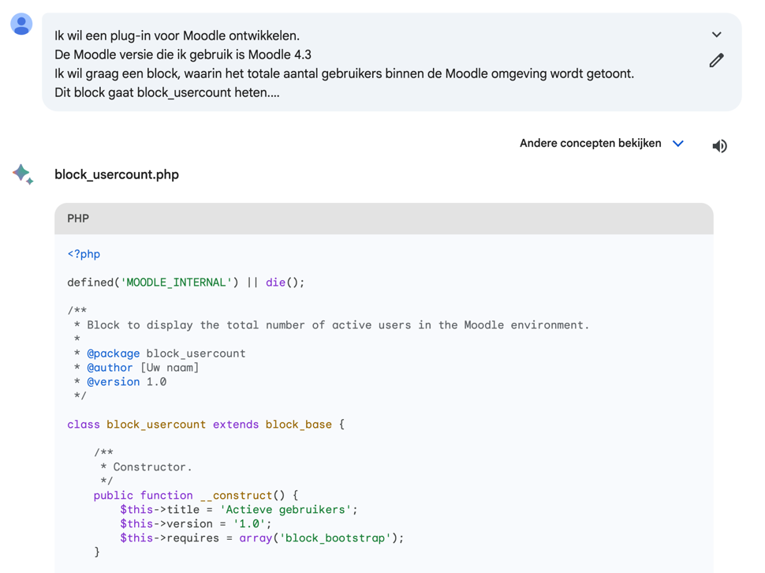

# Block Usercount

### Een AI product demonstratie

## Blocks developer documentatie
https://moodledev.io/docs/apis/plugintypes/blocks

## Code standaard
https://moodledev.io/general/development/policies/codingstyle

# Chat GPT's (GPT 3.5) interpretatie van de standaard prompt

## Welke benodigde bestanden zijn aanwezig
- `block_usercount.php` ✅
- `db/access.php` ❌
- `lang/en/block_usercount.php` ✅
- `version.php` ✅

Het ontbreken van `db/access.php` zorgt er voor foutmeldingen.\
Een block dient de capabilities `addinstance` en `myaddinstance` te definiëren in dit bestand.

## Welke nuttige bestanden zijn extra aanwezig
- `lang/nl/block_usercount.php`

Een vertaling in eigen taal kan erg handig zijn.
De NL is niet door Chat GPT gedefinieerd, maar als suggestie "Vervang 'en' door de juiste taalcode" aangeleverd.

## Welke bestanden zijn aanwezig maar overbodig
- `db/install.php`
- `db/upgrade.php`

Beide bestanden kunnen handig zijn bij ontwikkeling.\
`install.php` wanneer extra handelingen direct bij installatie van de plug-in uitgevoerd moeten worden\
`upgrade.php` wanneer zaken dienen te veranderen gedurende een upgrade van de plug-in.

In dit geval hoeft er echter niks uitgevoerd te worden tijdens installatie, 
en upgrade.php wordt meestal pas later in het traject toegevoegd wanneer de plug-in daadwerkelijk een upgrade ondergaat.

## Wat is goed
- `version.php` bevat de `MOODLE_INTERNAL` check
- De functie om de usercount daadwerkelijk op te halen in `block_usercount` is netjes in een eigen functie gezet.
- Het eindresultaat klopt.

## Wat is niet goed
- `db/install.php` en `db/upgrade.php` bevatten ook de `MOODLE_INTERNAL` check, echter is deze hier niet nodig.
- Moodle code standaard
  - Geen van de bestanden begint met de vereiste documentatie.
  - Nergens zijn docblock comments geplaatst voor de classes/methods.
  - Variabele benaming niet in in juiste formattering `$active_users_count` i.p.v. `$activeuserscount`
    - https://moodledev.io/general/development/policies/codingstyle#variables

## Conclusie
De basis is 'bijna' goed.\
Er ontbreekt een bestand en de documentatie is onvoldoende, maar het kan geïnstalleerd worden en een kloppend resultaat tonen.\
Vanuit hier kan doormiddel van meer communicatie met Chat GPT de ontbrekende en verkeerde zaken aangepakt worden.
