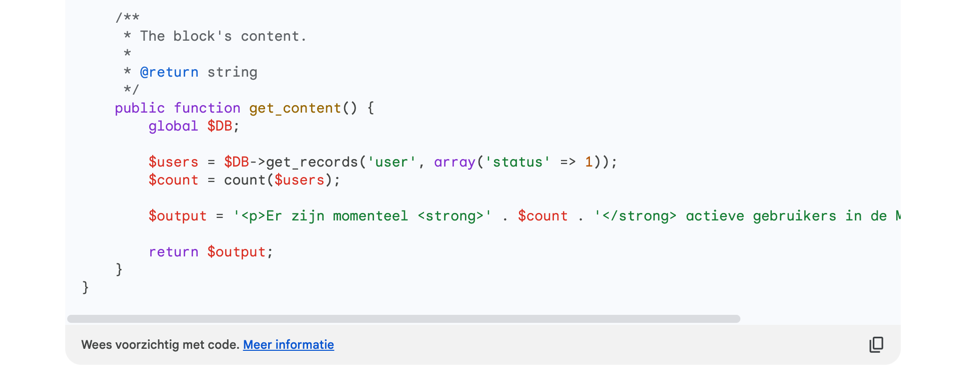

# Block Usercount

### Een AI product demonstratie

## Blocks developer documentatie
https://moodledev.io/docs/apis/plugintypes/blocks

## Code standaard
https://moodledev.io/general/development/policies/codingstyle

# Microsoft Bing's (GPT 4.0) interpretatie van de standaard prompt

## Welke benodigde bestanden zijn aanwezig
- `block_usercount.php` ✅
- `db/access.php` ❌
- `lang/en/block_usercount.php` ✅
- `version.php` ❌

Door het ontbreken van `version.php` is het niet mogelijk de plug-in te installeren.\
Het ontbreken van `db/access.php` zorgt voor foutmeldingen.\
Een block dient de capabilities `addinstance` en `myaddinstance` te definiëren in dit bestand.

## Welke nuttige bestanden zijn extra aanwezig
- Geen

## Welke bestanden zijn aanwezig maar overbodig
- Geen

## Wat is goed
- Als het geïnstalleerd had kunnen worden zou het eindresultaat wél kloppen.
- Variabele benaming volgens code standaard in
  - https://moodledev.io/general/development/policies/codingstyle#variables

## Wat is niet goed
- `block_usercount.php` bevat de `MOODLE_INTERNAL` check, echter is deze hier niet nodig.
- Moodle code standaard
    - Geen van de bestanden begint met de vereiste documentatie.
    - Nergens zijn docblock comments geplaatst voor de classes/methods.

## Conclusie
De basis is niet goed.\
Er ontbreken standaard bestanden waardoor de plug-in niet geïnstalleerd kan worden.
Hiervoor kun je additionele prompts geven aan Bing, echter is een conversatie gelimiteerd tot 30 antwoorden vanuit de kant van Bing.
Hierna zal de thread gesloten worden en is voorgaande informatie niet meer beschikbaar in een volgende thread.
