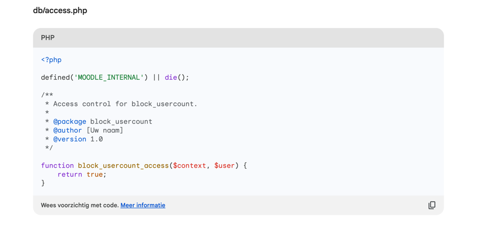

# Block Usercount

### Een AI product demonstratie

## Blocks developer documentatie
https://moodledev.io/docs/apis/plugintypes/blocks

## Code standaard
https://moodledev.io/general/development/policies/codingstyle

# Google Bard (Pathways Language Model) interpretatie van de standaard prompt

## Welke benodigde bestanden zijn aanwezig
- `block_usercount.php` ✅
- `db/access.php` ❌
- `lang/en/block_usercount.php` ❌
- `version.php` ❌

Door het ontbreken van `version.php` is het niet mogelijk de plug-in te installeren.\
Door het ontbreken van `lang/en/block_usercount.php` zijn er geen taalstrings beschikbaar.\
Het ontbreken van `db/access.php` zorgt voor foutmeldingen.\
Een block dient de capabilities `addinstance` en `myaddinstance` te definiëren in dit bestand.

## Welke nuttige bestanden zijn extra aanwezig
- Geen

## Welke bestanden zijn aanwezig maar overbodig
- `block_usercount.css`
  - Een styling bestand binnen een plug-in heet doorgaans styles.css/scss en wordt daardoor automatisch geladen.
  - De styling is erg basis, maar zou in theorie kunnen werken.
- `block_usercount.xml`
  - Dit is totaal onbekend en wordt binnen Moodle niet gebruikt.
  - De url waarheen gerefereerd wordt (http://docs.moodle.org/en/blockml/) bestaat ook niet.

## Wat is goed
- Niets

## Wat is niet goed
- `block_usercount.php` includes een niet bestaand lib bestand (`__DIR__ . '/lib/block_usercount.php`)
  - `class block_usercount` extend een verkeerde class.
    - `block_usercount_base` i.p.v. `block_base`
  - Gebruikt toch een directe SQL query
  - Ongebruikte en overbodige functies
- Moodle code standaard
    - Geen van de bestanden begint met de vereiste documentatie.
    - Nergens zijn docblock comments geplaatst voor de classes/methods.

## Conclusie
Dit is totaal onbruikbaar.
Misschien dat het iets kan worden met een beter geformuleerde prompt.
